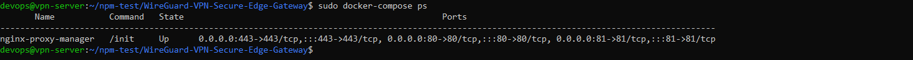
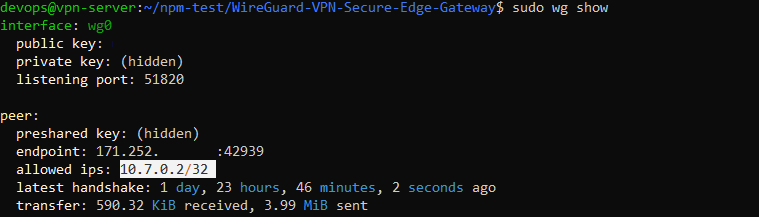

# WireGuard-VPN-Secure-Edge-Gateway

## Overview
A robust, secure, and automated Remote Access VPN gateway built on enterprise virtualization standards. This project integrates WireGuard VPN with Nginx Reverse Proxy and Dynamic DNS (DuckDNS), deployed on an Ubuntu Server cluster managed via Proxmox VE (KVM-based hypervisor).
## System Architecture

```mermaid
graph TD
    User([Internet Traffic / Remote Client]) -->|Dynamic IP Domain| DDNS[DuckDNS]
    DDNS -->|Port Forward 80/443/51820| PVE[Proxmox VE Hypervisor]
    PVE -->|KVM Virtual Machine| Ubuntu[Ubuntu Server VM]
    
    subgraph Docker Microservices Cluster
        Ubuntu -->|Port 80/443| Nginx[Nginx Reverse Proxy Manager]
        Ubuntu -->|Port 51820 UDP| WG[WireGuard VPN Gateway]
    end
    
    Nginx -->|SSL Termination| Web[Internal Web Services]
    WG -->|iptables / NAT Isolation| Subnet[Secure Subnets 10.7.0.x/24]
   Internal Web Services -->|Nginx Exporter
```

## Features

* **Enterprise Virtualization:** Provisioned and managed production-ready Ubuntu Server VMs within a Proxmox VE (KVM) environment.
* **High-Performance VPN:** Deployed WireGuard supporting up to 15+ concurrent users with optimized network throughput.
* **Dynamic DNS Integration:** Configured DuckDNS to automatically update the gateway's changing public IP, ensuring 100% connectivity uptime.
* **Reverse Proxy & SSL:** Utilized Nginx as a Reverse Proxy with SSL/TLS termination to securely route external traffic to internal web services.
* **Advanced Security:** Implemented strict firewall rules via iptables/nftables and NAT policies for total traffic isolation between subnets.
* **Infrastructure Automation:** Developed Bash scripts to fully automate client configuration generation and peer profile management.

## Deployment & Verification

The project has been deployed on an Ubuntu Server environment via Docker-Compose and has been verified to be stable with the following configuration proofs:
### 1. Container System Operating Stable (Container Status)
Tất cả các dịch vụ (Nginx Proxy Manager, WireGuard App Core) đều được cô lập và khởi chạy thành công qua Docker, giải phóng hoàn toàn xung đột kẹt Port 80 hệ thống.

  

### 2. WireGuard Interface Status & Peer Flow

Verify that VPN port `51820/UDP` is open and record the actual network traffic (Traffic Handshake) transmitted between the Client and Server.

  

### 3. Minh chứng Đổi IP & Định tuyến An toàn (Client Verification)
- **Trước khi bật VPN:** IP thuộc ISP nhà mạng cá nhân (Vị trí: Vietnam).
- **Sau khi bật VPN:** Toàn bộ lưu lượng mạng được định tuyến qua Secure Edge Gateway. Kiểm tra qua `iphub.info` hiển thị chính xác **IP Public của vpn-server Proxmox**.

  
*(Mẹo: Chụp ảnh giao diện App WireGuard trên máy tính của bạn hiện nút màu Xanh lá cây kèm số Data nhảy liên tục)*

## 💻 Getting Started

### Requirement
- Docker & Docker-Compose have been configured.
- Ensure that Ports `80`, `443`, and `51820/udp` are not occupied by native services (such as the operating system's nginx.service).

### Quick Start
1. Clone and cd:
   ```bash
   git clone https://github.com/tranngocsonDEV/WireGuard-VPN-Secure-Edge-Gateway.git
   cd WireGuard-VPN-Secure-Edge-Gateway
   ```
2. Assign permissions and configure DuckDNS environment variables (if applicable).
3. Assgin permissions for generate-client-qr.sh
   ```bash
    chmod +x scripts/generate-client-qr.sh
    sudo ./scripts/generate-client-qr.sh
   ```
5. Launch the container cluster using Docker-Compose (Grant Docker Socket permissions if needed):
   ```bash
   docker-compose up -d --build
   ```

# 🛠️ Tech Stack & Tools
* **Virtualization & OS:** Proxmox VE (KVM), Ubuntu Server
* **Network & Security:** WireGuard, Nginx, iptables, nftables, DuckDNS
* **Automation & DevOps:** Bash Scripting, Docker, Docker-Compose

## 📂 Project Structure
* `nginx/default.conf` - Nginx reverse proxy and server block configurations.
* `scripts/duckdns-update.sh` - Automated Bash script for peer and keys generation.
* `docker-compose.yml` - Multi-container setup for easy environment reproduction.
## Future Roadmap (Work in Progress)

* [ ] Integrate CI/CD pipelines via GitHub Actions to automate linting for Bash scripts.
* [ ] Implement Prometheus & Grafana to monitor VPN traffic metrics and server resource usage.

